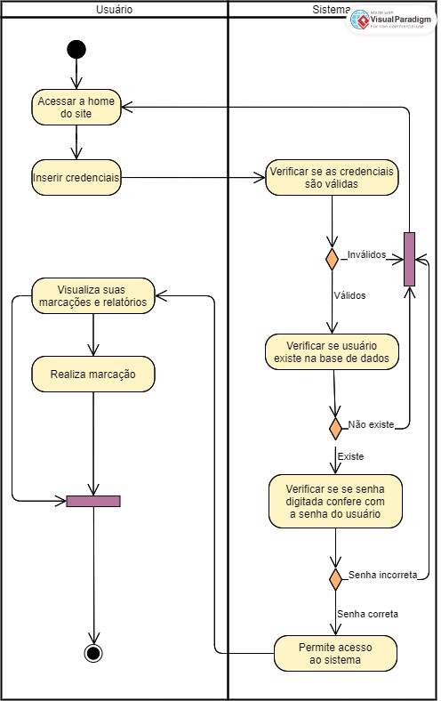

# Projeto Sistema de Marcação I/O

## Sumário Executivo

SUM_EX_PR_sisCheckin_2024ago26 Versão 1.0

08/03/2021

| **Versão** | **Autor(res)** | **Data**   | **Ação**                       |
| ---------- | -------------- | ---------- | ------------------------------ |
| 1\.0       | João Rodrigues | 26/08/2024 | Definição do Sumário Executivo |

**SUMÁRIO**

1. [VISÃO...................................................................................................................... 3](#_page2_x84.75_y84.75)
2. [RESTRIÇÕES.......................................................................................................... 3](#_page2_x84.75_y459.75)
3. [INTERESSADOS..................................................................................................... 3](#_page2_x84.75_y628.50)
4. [ANÁLISE DE RISCOS............................................................................................. 4](#_page3_x84.75_y84.75)
5. [ORÇAMENTO PRELIMINAR...................................................................................4](#_page3_x84.75_y243.00)
6. [CRONOGRAMA PRELIMINAR............................................................................... 4](#_page3_x84.75_y328.50)
7. [HIPÓTESES DO PROJETO.................................................................................... 4](#_page3_x84.75_y414.00)
8. [MODELO DE NEGÓCIO.......................................................................................... 4](#_page4_x84.75_y84.75)

**1. VISÃO**

O sistema deve permitir que toda a gestão do registro de horários dos usuários seja realizada de forma intuitiva, fácil e rápida. A aplicação deve ser desenvolvida para a web, permitindo o acesso online tanto por computadores quanto por dispositivos móveis.

Assim que o tempo de trabalho de um usuário estiver abaixo ou acima de um valor estipulado, o sistema enviará um e-mail para informá-lo. As informações de contato são importantes para notificações e ajustes. O sistema deve permitir a gestão completa de todos os registros de marcação dos usuários.

Os registros de horários serão identificados de forma única para cada usuário. Relatórios sobre o cumprimento da jornada, horas extras (tempo a mais que o usuário pode descontar em outro dia), e ausências (períodos em que o usuário não cumpriu toda a carga horária) são necessários. A identificação dos usuários será feita através de um e-mail único para cada um. Cálculos, como o total de horas trabalhadas e o saldo de banco de horas, devem ser automatizados para evitar erros e facilitar a gestão do tempo.

**2. RESTRIÇÕES**

- O acesso ao sistema deve ser possível através de dispositivos móveis e computadores.
- O sistema requer uma conexão à internet e não opera de forma offline.
- Acesso apenas a usuários autenticados.
- A aplicação deve ser compatível com os principais navegadores.

**3. INTERESSADOS**

- Autônomos
- Freelancers

**4. ANÁLISE DE RISCOS**

- Falhas de Conectividade: Por ser um que sistema depende de uma conexão à internet para funcionar, quaisquer interrupções na conectividade dos usuários podem impedir seu uso.
- Incompatibilidade de Navegadores: A falta de testes em navegadores menos comuns pode resultar em problemas de compatibilidade.

**5. ORÇAMENTO PRELIMINAR**

   Não foi definido.

**6. CRONOGRAMA PRELIMINAR**

   O projeto precisa ser concluído em 2 meses.

**7. HIPÓTESES DO PROJETO**

   Não foram definidas hipóteses para o projeto.

**8. MODELO DE NEGÓCIO**

   
